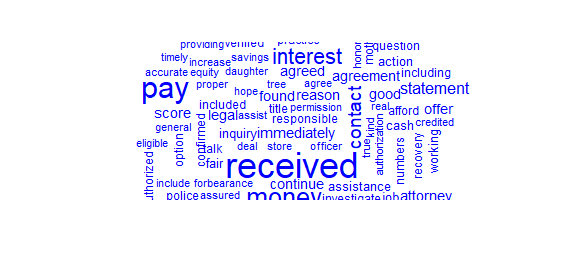

# Consumer-Complaint-Analysis
In this project I used a sentiment analysis on consumer complaints.

## Data Tidying 🧹
The first step to do was to get the data tidy so it was easier to analyze, and these were the steps:

- Tokens: splitting the teext into individual words

- Line Numbers: assigning a unique line number to each complaint narrative to keep track of the text's location
```
#This will transform the text data into a tidy format where each word is in its own row.
tidy_complaints <- Complaints %>%
  mutate(linenumber = row_number()) %>%  #Assuming each row is a separate line/narrative
  unnest_tokens(word, Consumer.complaint.narrative)  #Unnest tokens on the narrative
```


## Sentiment Analysis
For this analysis, bing and nrc lexicons were specifically used to classify words into different emotions.

- Bing lexicon: I joined the tokenized words with the bing lexicon because it classifies words into positive and negative sentiments
```
#Get the sentiment from the Bing lexicon
bing_sentiments <- get_sentiments("bing")

#Here I am joining with the tidy data to get the sentiment of each word
tidy_complaints_with_sentiment <- tidy_complaints %>%
  inner_join(bing_sentiments, by = "word")
```

- Nrc lexicon: I joined the tokenized words with the nrc lexicon because it includes a range of emotions.
```
#Now let's do sentiment analysis but with NRC lexicon 
nrc_sentiments <- get_sentiments("nrc")

#Join with the tidy data to get the sentiment of each word
tidy_complaints_with_sentiment <- tidy_complaints %>%
  inner_join(nrc_sentiments, by = "word")
```

## Graphs
### Sentiment counts from consumer complaints
I used a bar chart to show the count of positive and negative sentiments from the Bing lexicon. This chart helps to understand the overall sentiment distribution of the narratives.


```
ggplot(sentiment_count, aes(x = sentiment, y = n, fill = sentiment)) +
    geom_col(show.legend = FALSE) +
    xlab("Sentiment") +
    ylab("Count") +
    ggtitle("Sentiment Counts from Consumer Complaints") +
    theme_minimal() +
    theme(axis.text.x = element_text(angle = 45, hjust = 1))
```

### Wordclouds for Positive and Negative Sentiments
I used the wordclouds because they serve as an analytic tool to visualize predominant data in word form and in a scale from largest to smallest.
By doing two wordclouds for positive and negative sentiments, I highlight the most prominent words associated with each sentiment.

### positive wordcloud


```
#Filtering for positive sentiments
  positive_words <- tidy_complaints_with_sentiment %>%
    filter(sentiment == "positive") %>%
    count(word, sort = TRUE)

wordcloud(words = positive_words$word, freq = positive_words$n, max.words = 100, colors = "blue")
```

### negative wordcloud


```
#Filtering for negative sentiments
  negative_words <- tidy_complaints_with_sentiment %>%
    filter(sentiment == "negative") %>%
    count(word, sort = TRUE)

wordcloud(words = negative_words$word, freq = negative_words$n, max.words = 100, colors = "red") 
```

## Conclusion
This analysis provides insights into the sentiment of consumer feedback which can be important for identifying areas that may need attention from the companies involved.
