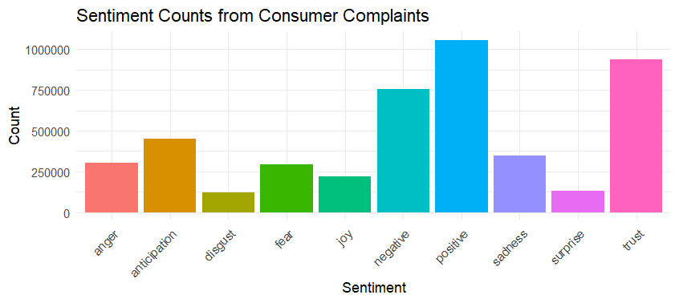
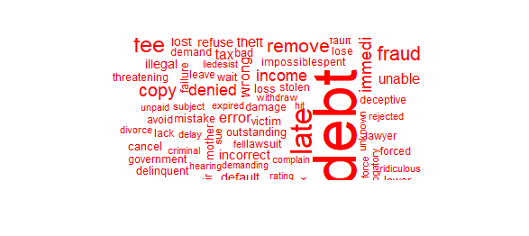

# Consumer-Complaint-Analysis
In this project I used a sentiment analysis on consumer complaints.

## Data Tidying
The first step to do was to get the data tidy so it was easier to analyze, and these were the steps:

- Tokens: splitting the teext into individual words

- Line Numbers: assigning a unique line number to each complaint narrative to keep track of the text's location

## Sentiment Analysis
For this analysis, bing and nrc lexicons were specifically used to classify words into different emotions.

- Bing lexicon: I joined the tokenized words with the bing lexicon because it classifies words into positive and negative sentiments

- Nrc lexicon: I joined the tokenized words with the nrc lexicon because it includes a range of emotions.

## Graphs
### Sentiment counts from consumer complaints
I used a bar chart to show the count of positive and negative sentiments from the Bing lexicon. This chart helps to understand the overall sentiment distribution of the narratives.

### Wordclouds for Positive and Negative Sentiments
I used the wordclouds because they serve as an analytic tool to visualize predominant data in word form and in a scale from largest to smallest.
By doing two wordclouds for positive and negative sentiments, I highlight the most prominent words associated with each sentiment.

### positive wordcloud

### negative wordcloud

## Conclusion
This analysis provides insights into the sentiment of consumer feedback which can be important for identifying areas that may need attention from the companies involved.
